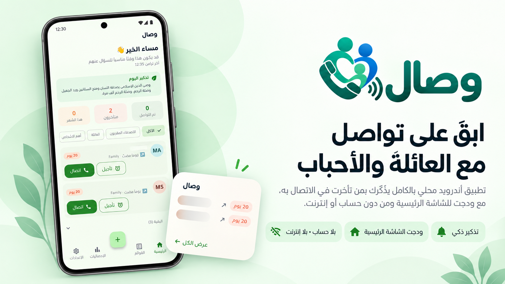

# وصال (Wisal)

العربية | [English](README.en.md)




**وصال** تطبيق أندرويد محلي بالكامل (لا يعتمد على الإنترنت) وثنائي اللغة
(عربي/إنجليزي)، يساعدك على صلة الرحم — البقاء على تواصل مع عائلتك وأحبائك.
يقرأ التطبيق سجل مكالماتك الحقيقي في هاتفك ليعرف من لم تتحدث معه فعلياً منذ
فترة، ويذكرك حسب الجدول الذي تحدده بنفسك، ويرسل لك جملة تحفيزية يومية. لا
يوجد حساب، ولا خادم، ولا أي اتصال بالإنترنت في طريقة عمل التطبيق.

## الميزات

- **تذكير ذكي** — يقرأ سجل مكالماتك الحقيقي ليعرف آخر مكالمة مجابة فعلياً
  مع كل شخص (10 ثوانٍ فأكثر، حتى لا تُحتسب مكالمة فائتة أو مرفوضة)، ويخبرك
  من تأخرت في التواصل معه حسب المدة التي حددتها لكل قائمة.
- **القوائم** — نظّم الأشخاص في قوائم (العائلة، الأصدقاء...) لكل منها مدة
  تذكير خاصة بها؛ قائمة "الأرحام" مخصصة لصلة الرحم وتحصل على مدة أقصر
  افتراضياً وشارة مميزة.
- **إشعاران مستقلان بوقت دقيق** — تذكير بالأشخاص المتأخرين وجملة صلة الرحم
  اليومية، لكل منهما مفتاح تشغيل مستقل، وتكرار (يومياً / كل يومين / أسبوعياً)،
  ووقت دقيق تختاره بنفسك.
- **ودجت الشاشة الرئيسية** — قائمة قابلة للتمرير بكل من تأخرت في الاتصال بهم،
  تتحدث في الخلفية دون الحاجة لفتح التطبيق.
- **اتجاه المكالمة والملاحظات** — اعرف بلمحة هل أنت من اتصل بهم آخر مرة أم
  هم من اتصلوا بك، أجّل تذكيراً، واحتفظ بملاحظة خاصة لكل شخص.
- **إحصائيات التواصل** — نظرة أسبوعية/شهرية على عدد الأشخاص الذين تواصلت
  معهم فعلاً، وأي قائمة تحافظ على التواصل معها بأفضل شكل.
- **ثنائي اللغة بالكامل** — العربية (اللغة الافتراضية) والإنجليزية، مع دعم
  كامل للكتابة من اليمين إلى اليسار، قابل للتبديل في أي وقت من الإعدادات.
- **دليل تعريفي عند أول استخدام** — يشرح خطوة بخطوة الأذونات المطلوبة،
  إعداد الإشعارات، وإضافة الودجت، ويمكن مراجعته لاحقاً من الإعدادات.

## لماذا أندرويد فقط؟

هذا ليس اختصاراً في الجهد — جوهر فكرة التطبيق بأكملها يعتمد على قدرة خاصة
بنظام أندرويد فقط. يعمل وصال عبر قراءة **سجل المكالمات** في جهازك
(`android.provider.CallLog`) لمعرفة متى تحدثت فعلياً مع شخص ما آخر مرة.
نظام iOS لا يملك أي واجهة برمجية مكافئة، رسمية أو غير رسمية: شركة Apple لا
تسمح لأي تطبيق خارجي، حتى بإذن صريح من المستخدم، بقراءة سجل مكالمات الجهاز.
أقرب ما يوجد في iOS (إطار عمل CallKit) يسمح فقط للتطبيق بـ"تزويد" بيانات
تعريف المتصل أو حظره، أو العمل كتطبيق اتصال عبر VoIP — لا يمكنه أبداً
"قراءة" المكالمات السابقة. بدون هذه القدرة تحديداً، لا يمكن بناء الميزة
الأساسية للتطبيق ("من لم أتصل به فعلياً منذ فترة؟") على الإطلاق، لذا لا
توجد نسخة مصغّرة منطقية من هذا التطبيق يمكن بناؤها لأجهزة آيفون.

## الخصوصية والأمان

هذا هو الجزء الأهم، لذا نعرضه كاملاً، مدعوماً بأمور يمكنك التحقق منها بنفسك
في هذا المستودع:

- **لا يوجد اتصال بالإنترنت، نقطة.** التطبيق لا يطلب أي إذن شبكة في نسخ
  الإصدار (release). (نسخ التصحيح (debug) في أندرويد تحصل على إذن
  `INTERNET` يُضاف تلقائياً من أدوات Flutter نفسها فقط لتمكين إعادة التحميل
  السريع (hot reload) أثناء التطوير — هذا سلوك قياسي من Flutter، وليس من
  كود التطبيق، وهو غير موجود في نسخ الإصدار. يمكنك التحقق من هذا بنفسك: ابنِ
  النسختين وقارن ملفات
  `android/app/build/intermediates/merged_manifest/*/**/AndroidManifest.xml`.)
- **لا تحليلات، لا تقارير أعطال، لا أي مكتبات خارجية (SDKs).** تحقق من
  `pubspec.yaml` و `android/app/build.gradle.kts`: كل اعتماديّة هي مكتبة
  وظيفية محلية بحتة (قاعدة بيانات محلية، إشعارات محلية، جدولة في الخلفية،
  قائمة مشاركة النظام، فتح الروابط/تطبيق الاتصال). لا شيء منها يتواصل مع
  أي خادم.
- **بياناتك لا تغادر هاتفك أبداً.** تُقرأ جهات الاتصال وسجل المكالمات
  مباشرة من موفري محتوى أندرويد الخاصين بالنظام، وتُكتب فقط في قاعدة بيانات
  SQLite وإعدادات `SharedPreferences` الخاصة بالتطبيق — ولا مكان آخر أبداً.
  `android:allowBackup="false"` إضافة إلى ملف `data_extraction_rules.xml`
  صريح يستثني قاعدة البيانات والإعدادات والملفات من **كل من** النسخ
  الاحتياطي السحابي لأندرويد **و** نقل البيانات بين الأجهزة — فبياناتك لا
  تُنسخ حتى عند عمل نسخة احتياطية أو تبديل الهاتف.
- **قراءة فقط، حيث يهم الأمر.** التطبيق لا يطلب أبداً إذن `WRITE_CONTACTS`
  أو `WRITE_CALL_LOG` — لا يمكنه تعديل جهات اتصالك أو سجل مكالماتك حتى لو
  أراد ذلك.
- **لا بيانات شخصية في السجلات (logs).** أسطر التشخيص (بعلامة `Wisal`،
  ولا تظهر إلا عبر `adb logcat` على جهاز تملكه) تسجّل فقط الأوقات والأعداد
  والقيم المنطقية — لا اسماً ولا رقماً ولا ملاحظة أبداً.
- **مفتوح المصدر، فلا داعي لتصديق أي من هذا الكلام دون تحقق** — كل ما
  ذُكر أعلاه أمر يمكنك البحث عنه بنفسك في الكود.

### الأذونات المطلوبة، ولماذا

| الإذن | السبب |
|---|---|
| `READ_CONTACTS` | لعرض جهات اتصالك عند إنشاء قائمة، ولمطابقة أرقام الهواتف بالأسماء. |
| `READ_CALL_LOG` | لمعرفة آخر مكالمة مجابة فعلياً مع كل شخص — جوهر الميزة الأساسية. |
| `POST_NOTIFICATIONS` | لعرض إشعاري التذكير (أندرويد 13+ يتطلب هذا الإذن صراحة). |
| `SCHEDULE_EXACT_ALARM` | ليصل الإشعار في الوقت الدقيق الذي اخترته، لا "وقتاً تقريبياً". |
| `RECEIVE_BOOT_COMPLETED` | لإعادة جدولة الإشعارات بعد إعادة تشغيل الهاتف (تنبيهات `AlarmManager` لا تبقى بعد إعادة التشغيل). |
| `WAKE_LOCK`, `ACCESS_NETWORK_STATE`, `FOREGROUND_SERVICE` | يعلنها `androidx.work` (مكتبة WorkManager) نفسها، وتُستخدم للتحديث الدوري للبيانات في الخلفية. لا يطلبها كود التطبيق مباشرة، ولا يمنح أي منها وصولاً للإنترنت بحد ذاته. |

## البنية التقنية (Architecture)

- **Flutter** (`lib/`) — الواجهة، القوائم، منطق التذكير، النصوص ثنائية
  اللغة (`core/i18n.dart` — دالة بسيطة `tr(ref, en, ar)` دون أي أدوات توليد
  كود)، وقاعدة بيانات SQLite محلية (`core/database/app_database.dart`)
  للقوائم والأعضاء والإعدادات وسجل صغير للتواصل تُستخدم للإحصائيات.
- **Kotlin** (`android/app/src/main/kotlin/com/wisal/app/`) — قناة
  اتصال واحدة (`MethodChannel`) باسم `wisal/native` تتولى الأذونات، جهات
  الاتصال، قراءة سجل المكالمات، ومطابقة أرقام الهواتف (`Sync.kt`)؛
  `AlarmManager` (`Alarms.kt`) يجدول الإشعارين ليصلا في وقت دقيق حتى دون
  تشغيل محرك Flutter؛ `WorkManager` (`Background.kt`) يقوم بتحديث دوري
  للبيانات (~6 ساعات)؛ و `RemoteViewsService`
  (`ReconnectWidgetService.kt`) يشغّل ودجت الشاشة الرئيسية القابل للتمرير.
- يُزامن Flutter القوائم/الأعضاء/الإعدادات إلى التخزين الأصلي (native)
  بعد كل تغيير (`AppDatabase.pushConfig`)؛ ويعيد الجانب الأصلي جدولة
  التنبيهات من نفس الإعدادات بعد كل حفظ، لكن فقط عند تغيّر إعدادات
  الإشعارات فعلياً (`Alarms.rescheduleFromConfig`) — حتى لا تؤدي مزامنة
  روتينية في الخلفية إلى تأجيل تنبيه مجدول مسبقاً عن طريق الخطأ.
- جمل صلة الرحم اليومية مضمّنة بشكل متطابق كأصل (asset) في Flutter
  (`assets/sentences.txt`) ومورد خام (raw resource) في أندرويد
  (`res/raw/sentences.txt`)، لذا تتطابق دائماً بطاقة الشاشة الرئيسية
  وإشعار اليوم على نفس الجملة (`epochDay % count`).

### هيكل المشروع

```
wisal_app/
├── lib/
│   ├── core/            # قاعدة البيانات، النماذج، الجسر الأصلي، التصميم، الترجمة، منطق التذكير
│   └── features/        # الرئيسية، القوائم، جهات الاتصال، الإعدادات، الإحصائيات، الدليل التعريفي
├── android/app/src/main/
│   ├── kotlin/com/wisal/app/   # المزامنة الأصلية، التنبيهات، الودجت، الإشعارات
│   └── res/                    # تخطيط وألوان الودجت، أيقونة التطبيق، النصوص (عربي/إنجليزي)
├── assets/              # الخطوط المضمّنة (Tajawal، Inter) وقائمة جمل صلة الرحم
└── test/                # اختبارات Dart
```

## البدء

يتطلب [Flutter SDK](https://flutter.dev) وأدوات Android SDK/platform-tools
(`sdkmanager`, `adb`) ضمن `PATH`.

```bash
cd wisal_app
flutter pub get
flutter run                       # نسخة تصحيح على جهاز/محاكي متصل
flutter build apk --release       # نسخة إصدار ← build/app/outputs/flutter-apk/app-release.apk
```

التثبيت اليدوي (sideloading) مطلوب في كل الحالات: يقيّد Google Play إذن
`READ_CALL_LOG` على تطبيق الاتصال الافتراضي (default dialer) فقط، وهذا
التطبيق ليس كذلك، فلا يمكن توزيعه عبر متجر Play.

### توقيع نسخ الإصدار (Signing)

يبحث `android/app/build.gradle.kts` عن ملف `android/key.properties`: إن لم
يكن موجوداً، تُستخدم مفاتيح التصحيح (debug) كبديل (حتى يبني المشروع بنجاح
لأي شخص يستنسخ المستودع)؛ وإن كان موجوداً، تُوقَّع نسخة الإصدار بالمفتاح
الحقيقي الذي يشير إليه. لا يُضمَّن أبداً المفتاح (keystore) ولا ملف
`key.properties` في git — `android/.gitignore` يستثني كليهما.

لإنشاء هوية توقيع خاصة بك:

```bash
keytool -genkeypair -v -keystore ~/your-release-key.jks \
  -alias your-alias -keyalg RSA -keysize 4096 -validity 10000
```

ثم أنشئ ملف `android/key.properties`:

```properties
storePassword=<كلمة المرور التي حددتها أعلاه>
keyPassword=<نفس كلمة المرور أو كلمة مرور منفصلة>
keyAlias=your-alias
storeFile=/home/you/your-release-key.jks
```

احتفظ بنسخة احتياطية من ملف المفتاح وكلمة مروره في مكان آمن خارج المستودع
(مدير كلمات مرور، لا ملف نصي) — يتطلب أندرويد نفس مفتاح التوقيع لكل تحديث
مستقبلي للتطبيق؛ فقدان أي منهما يعني عدم القدرة على نشر أي تحديث تحت نفس
هوية التطبيق أبداً.

بعض الهواتف (Xiaomi، Oppo، Samsung، وأنظمة أخرى تدير البطارية بصرامة) تقيّد
عمل التطبيقات في الخلفية افتراضياً — الإعدادات ← تحسين البطارية داخل
التطبيق يرشدك للسماح بذلك، مما يجعل التذكيرات المجدولة أكثر موثوقية.

## الاختبارات

```bash
cd wisal_app && flutter test                                  # Dart
cd wisal_app/android && ./gradlew :app:testDebugUnitTest       # Kotlin (تطبيع أرقام الهواتف)
```

## ملاحظات تقنية

- المكالمة المجابة = واردة/صادرة بمدة ≥ 10 ثوانٍ (`MIN_CALL_SECONDS` في
  `Sync.kt`) — مكالمة فائتة أو ردّ بريد صوتي سريع لا تُحتسب محادثة حقيقية.
- يزيل منتقي جهات الاتصال التكرار حسب رقم الهاتف بعد تطبيعه (`Contacts.list`
  في `Sync.kt`): أندرويد لا يدمج دائماً جهات الاتصال الأولية القادمة من
  مصادر مختلفة (تخزين محلي في الهاتف مقابل حساب Google) في جهة اتصال واحدة
  مجمّعة، لذا غالباً ما يترك نقل جهات الاتصال بين الهواتف نفس الشخص كجهتي
  اتصال منفصلتين بنفس الرقم — تُعرض الأولى فقط.
- رمز الدولة الافتراضي للأرقام المحلية هو 213 (الجزائر) — انظر
  `PhoneNormalizer` في `Sync.kt`؛ غيّر `CC` هناك لرمز دولة افتراضي مختلف.
- مكالمات WhatsApp/Telegram غير موجودة في سجل مكالمات أندرويد على أغلب
  الأجهزة حالياً، فلا يمكن تضمينها. (يقدّم أندرويد 16.1 سجل مكالمات موحّد
  على مستوى النظام قد يعرضها يوماً ما، لكنه يتطلب كلاً من إصدار النظام هذا
  وموافقة التطبيق الآخر — غير متاح عملياً بعد.)
- قائمة الودجت قابلة للتمرير (`ReconnectWidgetService`/`RemoteViewsFactory`)
  وتعرض كل شخص متأخر، لا الأوائل فقط؛ تُعرض الأسماء دائماً من اليسار إلى
  اليمين فيها (`textDirection="ltr"`) حتى لا تنقلب محاذاة الأسماء العربية.
- اللغة الافتراضية عند أول تثبيت هي العربية؛ مفتاح تبديل داخل التطبيق
  (الإعدادات ← اللغة، أو الدليل التعريفي) يبدّلها، بشكل مستقل عن لغة نظام
  الهاتف. الاستثناء الوحيد هو اسم التطبيق الظاهر تحت الأيقونة في الشاشة
  الرئيسية، الذي يرسمه أندرويد دائماً حسب لغة نظام *الهاتف*، لا هذا الإعداد
  داخل التطبيق.
- قوائم "الأرحام" تغيّر فقط المظهر (شارة، أيقونة، مدة افتراضية أقصر) — ليست
  مساراً برمجياً منفصلاً، بل تعتمد على نفس مدة التذكير لكل قائمة التي
  تستخدمها المزامنة أصلاً.

## المساهمة

التبليغ عن المشاكل (Issues) وطلبات السحب (Pull Requests) مرحّب بها. بضعة
أمور تحافظ على جودة المشروع:
- شغّل `flutter analyze` و `flutter test` قبل فتح أي طلب سحب — لا يوجد
  تكامل مستمر (CI) حالياً، فهذا هو الفحص الوحيد.
- حافظ على خاصية "لا إنترنت، لا تتبع" — أي اعتماديّة أو تغيير قد يضيف أياً
  منهما يحتاج سبباً وجيهاً جداً وتوضيحاً صريحاً في وصف طلب السحب.
- اتبع نفس نمط ثنائية اللغة الموجود (`tr(ref, 'English', 'العربية')`) لأي
  نص جديد ظاهر للمستخدم.

## الترخيص

GPL-3.0 — انظر [LICENSE](LICENSE). جميع الحقوق محفوظة © 2026 Soh-AI-B.
